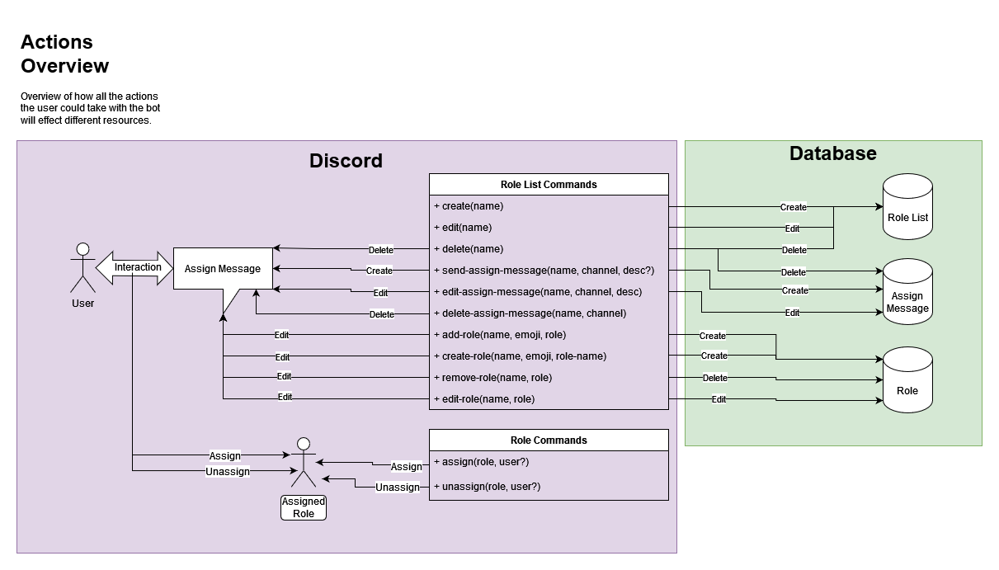
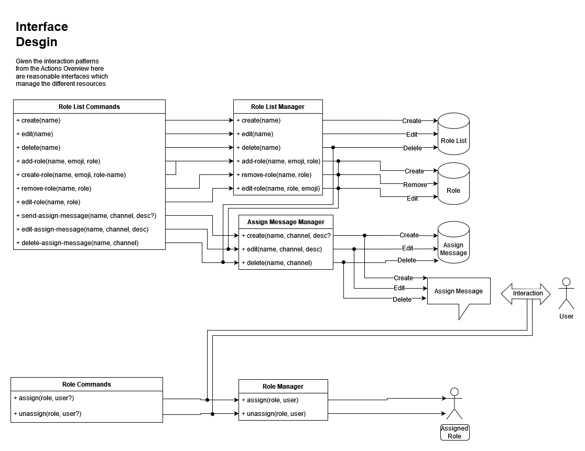

# Design
Outlines goals for how the role bot should be made.

# Table Of Contents
- [Overview](#overview)
- [Functional Requirements](#functional-requirements)
- [User Experience](#user-experience)
- [Data Model](#data-model)
- [Code Architecture](#code-architecture)

# Overview
- The [Functional Requirements](#functional-requirements) outlines the goals for the bot.
- The [User Experience](#user-experience) section roughly outlines the features which implement the requirements.
- The [Data Model](#data-model) section describes how data will be stored in order to back the features.
- The [Code Architecture](#code-architecture) section describes how the code will be structured to implement the user experience.

# Functional Requirements
- Add and remove a set of Discord roles as a non-admin
- Discover existing roles
- Create new roles as an admin
- Delete roles as an admin
- Edit existing roles as an admin
- Categorize roles by their theme

# User Experience
Role are categorized into lists which group related roles (ex., game roles vs location roles).

## End User
A message for each role list could be placed in a server's welcome channel. A reaction list style message will not be used due to the 50 reaction limit. Instead a message with a list of roles and their associated emojis will be display. Along with a button the user can click to trigger a more graphical role assignment process:

> ### Game Roles
> Assign roles to tell people what games you are interested in:
>
> 🏴‍☠️ Sea Of Thieves  
> 🏎️ Rocket League  
> ⚽ FIFA  
> 🏀 2K  
>   
> [ Assign Roles ]

When clicked a message which can only be seen by the interacting user would be sent which shows a select menu of all the possible roles with their emojis. Once the user has selected / deselected the roles they wish a button can be clicked to complete the role assignment.

> ### Game Roles
> Select or deselect the roles you wish to have assigned to your user:  
>   
> | Role Select Menu |  
>  
> [ Save Roles ]

Once the user has clicked the save button the message will either: disappear or show a success message.

The intro text of the initial role list message can be configured. This list message will also be updated as new roles get added and deleted.

## Admin
Administration will be completed via a web UI and not Discord slash commands. This is because the user experience would be too complex via slash commands, but would be very simple and intuitive via a website.

# Data Model
- Role List
  - `id` (Integer)
  - `name` (String)
- Role List Role
  - `id` (Integer)
  - `role_list_id` (Integer, FK to Role List)
  - `emoji` (String)
  - `name` (String)
  - `discord_role_id` (Integer)
- Role List Assign Message
  - `id` (Integer)
  - `role_list_id` (Integer, FK to Role List)
  - `discord_channel_id` (Integer)
  - `description_text` (String)

# Code Architecture
To determine a good layout for the code all the bot interactions and how they would modify Discord and database data were examined:

From this diagram a series of interfaces were derived:

These two diagrams' source can be found in [`docs/interface-design.drawio`](./docs/interface-design.drawio).

The following code components will exist:

- Discord Adapter
- Role List Manager
- Assign Message Manager
- Role Manager
- Role List Repository
- Role Repository
- Assign Message Repository
